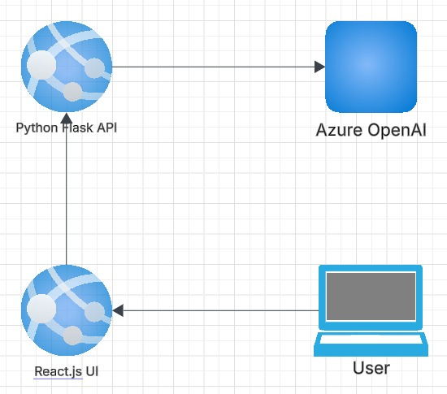

#   Global AI Hyderabad - Monthly Online Event - Mar 2025

## Date Time: 23-Mar-2025 at 09:00 AM IST

## Event URL: [https://www.meetup.com/global-ai-hyderabad/events/306606120](https://www.meetup.com/global-ai-hyderabad/events/306606120)

## YouTube URL: [https://www.youtube.com/live/RUeaM9Rix60?si=jj5it7B9Wy4HDdRl](https://www.youtube.com/live/RUeaM9Rix60?si=jj5it7B9Wy4HDdRl)

## Title : Bringing AI to Life – React, Tailwind, and UI Integration

## *🎯 Goal of the Session:*  
 By the end of this session, attendees will:  
 ✅ Set up a *React + Tailwind CSS* project.  
 ✅ Build a *fully responsive chat UI*.  
 ✅ Ensure the UI follows a *modern, clean design* with Tailwind.  
 
 ---
 
 
 
 ### *1️⃣ Introduction (2 min)*
 - "Welcome, everyone! Now that we've built the backend, it’s time to focus on the *frontend experience*."
 - "I’ll show you how to create a *beautiful, responsive UI* using *React and Tailwind CSS*."
 - "At the end of this session, we’ll have a chat interface ready, and in the next session, Sowmya will integrate it with Flask."
 
 ---
 
 
 
 
 
 
 ### *2️⃣ Setting Up the React Project (4 min)*
 - *Create a new project using Vite:*  
   bash
   npm create vite@latest flask-react-aoai-ui --template react-ts
   cd flask-react-aoai-ui
   npm install
   
 - *Install Tailwind CSS:*  
   bash
   npm install -D tailwindcss postcss autoprefixer
   npx tailwindcss init -p
   
 - **Configure Tailwind in tailwind.config.js:**  
   js
   export default {
     content: ["./index.html", "./src/**/*.{js,ts,jsx,tsx}"],
     theme: {
       extend: {},
     },
   };
   
 - **Import Tailwind into index.css:**  
   css
   @import 'tailwindcss/base';
   @import 'tailwindcss/components';
   @import 'tailwindcss/utilities';
   
 - "Now we are ready to build our chat UI!"
 
 ---
 
 ### *3️⃣ Creating the Chat UI (6 min)*
 - "Let’s design the main chat component using Tailwind CSS."
 - **Create Chat.tsx:**  
   tsx
   import { useState } from "react";
 
   const Chat: React.FC = () => {
     const [prompt, setPrompt] = useState<string>("");
 
     return (
       

         <h2 className="text-2xl font-semibold text-gray-800">Chat with AI 🤖</h2>
         
         

           
Your response will appear here

         

 
         <textarea
           className="w-full p-3 border rounded-lg shadow-md focus:ring focus:ring-blue-300"
           placeholder="Type your question..."
           value={prompt}
           onChange={(e) => setPrompt(e.target.value)}
         />
 
         <button
           className="bg-blue-600 text-white px-6 py-2 rounded-lg hover:bg-blue-700 transition"
         >
           🚀 Send
         </button>
       

     );
   };
 
   export default Chat;
   
 - "This gives us a *clean, structured UI*, ready for integration."
 
 ---
 
 ### *4️⃣ Running the React App & Testing (3 min)*
 - *Start the React app:*  
   bash
   npm run dev
   
 - "We now have a working UI. Next, Srivalli will integrate this with Flask."
 
 ---
 
 ### *5️⃣ Wrap-up & Next Steps (1 min)*
 - "Now we have a structured UI. In the next session, *Srivalli will connect this UI to Flask and handle API communication.*"
 - "Thank you! 🎉"
 
 ---